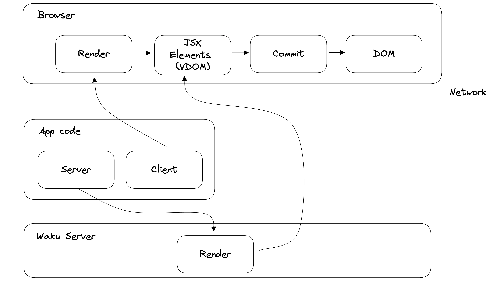

# RSC (React Server Components)

_(Disclaimer: We will be covering RSC using [waku](https://github.com/dai-shi/waku). A minimalistic RSC framework where we can try out RSC outside of Next.js)_

## What is RSC?

In simple terms RSC allows you to write React components that run on the server. Instead of rendering on the client, or the entire page being rendered on the server, RSC allows you to render only the components that need to be rendered on the server and send only the minimal amount of JavaScript to the client. Since React components can run on the server, we can write components that directly interact with the database, or other services, without having to write a separate API. Or we can write components that are only rendered on the server and never sent to the client, the benifit of this is we can keep heavy components off the client and only send the minimal amount of JavaScript to the client.

> **_Note: Waku does not do SSR currently, meaning the initial HTML does not have the the components rendered. But the whole point of RSC is that it will be rendered on the server, so the initial HTML should have the components rendered 🤔. We will uncover more about RSC in the following sections and understand what RSC actually mean_**

### Time for some code

> We will not be going over framework specific code, but rather the concepts of RSC. So if you are not familiar with Waku, you can still follow along.

Navigate to [`examples/01`](./examples/01) and run `npm install` and `npm run dev`. Open up <http://localhost:300>, the app should be running.

We have the basic starter from Waku (have kept it to the bare minimum to focus on understanding the technology). We have two components in the whole page. One with the text `This is a server component` and another one with the text `This is a client component` and an interactable button with a counter.

Let's take a closer look at the components. Open up [`examples/01/src/App.tsx`](./examples/01/src/App.tsx), `App` is a simple component that takes in a `name` prop and renders some text and renders a `Counter` component. The `App` component is also a server component. But where did we specify that `App` is a server component? We didn't. By default all components are server components. Since it is a server component, none of the code in the `App` component will be sent to the client.

Now let's take a look at the [`Counter`](./examples/01/src/Counter.tsx) component. Right off the bat we can see that at the top of the file we have marked the file with a `"use client"` directive. This lets the compiler know that this component is a client component and should be bundled and sent to the client. The component itself is a simple counter component that increments the counter on every click.

But how does it all fit together 🤔.

### Architecture

> **_Note: RSC architecture is not set in stone, and can vary from framework to framework. We will be covering the architecture of Waku._**

As we have seen in the previous section an app built with RSC will have server components and client components. For every request to the server the server has to execute and render the server component and send it to the client. The client component is bundled and sent to the client (note: The client component is not rendered on the server in Waku instead special `voids` are created, but Next.js renders the client component during the SSR phase and sends it to the client along with the rendered HTML).

In the browser, the index HTML is downloaded and React is initialised. All the module dependencies are downloaded which includes the rendered server components and the client components. React interprets the rendered server components response and constructs a VDOM. It then fills in the voids in the VDOM with the client components (remember the client components are not rendered on the server). The client components are then commited to the DOM and the app is ready to be interacted with.

This is the high level overview of how RSC works. Let's take a look at the different components in detail.

## Server Components

TODO

## Client Components

TODO

## Gotchas

TODO

- Nesting server components inside client components

## Examples

TODO

## Conclusion

TODO
